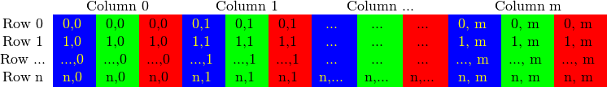

# ImageCompV2

*NOTE:* It is the exact same code than the previous version, the only thing that changed was the way I uploaded the repo. This one is more organized and can be cloned to run 
as a Visual Studio Project. The other one probably not. If you want to make the comparison between codes, here is the link to the other [repo](https://github.com/CelisIvan/CUDAImageCompare).

## Introduction
This is a program that compares two images in two modes: Hard (pixel by pixel) and overall silhouette.
It uses *Parallel Programming* (CUDA) in order to enhace performance. It works perfectly for small and large images. 

## Parallel Programming
In very simple terms, it is the use of multiple resources, in this case, processors, to solve a problem. This type of programming takes a problem, breaks it down into a series of smaller steps, delivers instructions, and processors execute the solutions at the same time[1]. So, we are using the facilities that CUDA and NVIDIA give us to take advantage of the architecture. This two tools allow us to create multiple threads that will be in charge of processing a portion of the problem at the same time. 

## Boosting up my code with CUDA
### Linearizing my matrix
According to OpenCV Docs, images are stored in a container called _Mat_ which is basically a Matrix. The size of the matrix depends of the color system used. More accurately, it depends from the number of channels used. In case of a gray scale (2 channels) image we have something like: [2]


Figure 1: Matrix for grayscale Image

On the other hand for color images like PNG format (3 channels) (which is the one we are using on the project) it will be something like:



Figure 2: Matrix for Colored Image


Because in many cases the memory is large enough to store the rows in a successive way the rows may follow one after another, creating a single long row. Because everything is in a single place following one after another this may help to speed up the scanning process. We can use the isContinuous() function to ask the matrix if this is the case. It will almost always be a positive answer, only in cases where de image is extremely long, it may be a non successive row.

Knowing this, it's easy to determine the way we are going to access the matrix with a linearized index. As we know the _basic_ formula for a n(rows) by m(columns) matrix is always: 

``` cpp
int main(){

    int index = i * m + j;
}
```
Where _i_ is be the variable which will be used to reffer to the rows of the original matrix and _j_ will be the one used to go through the columns. 

So, back to this project. As I wanted to make sure that each thread is in charge to check each pixel. I will use several 1 dim blocks with several threads each (512) to be sure I have enough threads for any image. The way I'm getting the blocks is: _Imagewidth * ImageHeight / 512_. By doing it this way I will not have unnecessary unused blocks 
And for getting the indexes of the image array that each thread will work with I'm using the next formula: 

``` cpp
int main(){

    int id = (threadIdx.x + blockIdx.x * blockDim.x) * channels;
}
```

Where _threadIdx.x_ will be de *x index of the thread* within the block. 
blockIdx.x is the *x index of the block* within the "grid" made of blocks.
blockDim.x is the *size per block* 
And then I will iterate over the channels with a for loop. 

So a visual representation for a colored image of what each thread will be doing is more or less like this:


Figure 3: Representation of threads and image array

### Hard comparison
This is actually the simplest comparison to do. It just goes through every pixel and checks if they are exactly the same. If they are not, it will change the color of that pixel to the inverse of it, in order to detect the difference with ease.


### Silhouette comparison
For this case the only thing that changes is that there is a image pre processing. The image needs to be  transformed to grayscale in order to implement the Canny algorithm to it and detect borders. For more info, visit: [Canny Open CV] (https://docs.opencv.org/master/da/d22/tutorial_py_canny.html)

After the canny images are obtained, these are the ones passed to the same algorithm mentioned above. 


## Use cases

### FIA's avoiding
It is useful for careers like Architecture or graphic design where an assigment is create a design or structure. As a teacher you may ask for images from specific perspectives and sizes and then you can see if they are actually original or it's a copy from other partner or previous work.

### Enterteinment
Just for fun, you may use it to solve small ridles like the ones that look like this:


## How to Run the Application
You must dowmload the project and wo to the /x64/Release folder and then just execute the _.exe_ file that is in there.  If you want to make comparisons between two specific images, those images should be stored in that folder. Of course, you must have a GPU and CUDA installed.  
 *Important: the images should be the same size and png format*


## References 
[1] Best Computer Science Degrees. (2020) _What is parallel programming?_ [https://www.bestcomputersciencedegrees.com/faq/what-is-parallel-programming/#:~:text=In%20very%20simple%20terms%2C%20it,solutions%20at%20the%20same%20time](https://www.bestcomputersciencedegrees.com/faq/what-is-parallel-programming/#:~:text=In%20very%20simple%20terms%2C%20it,solutions%20at%20the%20same%20time)

[2] OpenCV. _How to scan images, lookup tables and time measurement with OpenCV_ [https://docs.opencv.org/3.4/db/da5/tutorial_how_to_scan_images.html](https://docs.opencv.org/3.4/db/da5/tutorial_how_to_scan_images.html)

[3] OpenCV. _Canny Algorithm_. [https://docs.opencv.org/master/da/d22/tutorial_py_canny.html](https://docs.opencv.org/master/da/d22/tutorial_py_canny.html)
